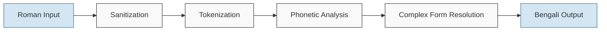

# Obadh Engine

A linguistically accurate Roman to Bengali transliteration engine for an Avro-successor Bangla typing system.

Obadh is the deterministic, fast, dependency-light entry layer for that larger system. This crate is not a wholesale Avro-rule-table clone, not a spelling guesser, and not a word-by-word compatibility table: the core engine must be 100% rule-based, predictable, and explicit. Users are expected to type deliberately according to the documented Roman input rules; correction, suggestion, ranking, personalization, and dictionary assistance belong above this layer, not inside it.

## Quick Start for Developers

```bash
# Clone the repository
git clone https://github.com/nsssayom/obadh_engine.git
cd obadh_engine

# First time setup: Install required tools and dependencies
rustup toolchain install 1.89.0 # Matches rust-toolchain.toml
brew install wasm-pack binaryen # Provides wasm-pack and wasm-opt for optimized WASM builds
cd www && npm install && cd .. # Install Node.js dependencies for the web interface

# Run the transliterator with rule-probe text
cargo run --bin obadh -- 'kA khA gA t`` 12.34'

# Try the debug mode with performance metrics
cargo run --bin obadh -- --debug 'kA khA gA t`` 12.34'

# Build a release binary
./build.sh bin

# Run tests
cargo test

# Build WASM and start development mode with auto-reload
./build.sh dev

# Or build everything and start a production-ready server
./build.sh start
```

## Overview

Obadh Engine is a Rust-based transliteration system designed to convert Roman text to Bengali according to explicit phonetic and orthographic rules. It aims to provide accurate transliteration with high fidelity to Bengali linguistic principles, while maintaining a clean, modern, and maintainable codebase.

As an Avro successor, Obadh keeps the familiar Roman-to-Bangla typing lineage while drawing a hard boundary around this crate: the core transliterator is deterministic infrastructure. It should not silently correct ambiguous input, infer intended words, or embed whole-word exceptions. If the user wants a specific Bengali spelling, the user must type the Roman sequence that encodes that spelling under the rules.

## Development Status

The repository is under active redevelopment. The current baseline has a green Rust test suite for sanitization, tokenization, valid conjunct filtering, explicit hasant notation, reph, phola forms, local orthographic rules, and the CLI/library path. Known gaps are tracked in `KNOWN_ISSUES.md`; the biggest remaining area is broader corpus validation of rule behavior against intentional Roman input patterns.

## Philosophy

Obadh Engine is built on these core principles:

1. **Deterministic Transliteration**: The engine uses deterministic phonetic rules rather than machine learning approaches, ensuring consistent and predictable results.

2. **Rule-Based Base Layer**: The core engine must not depend on dictionary lookup, whole-word overrides, probabilistic correction, or hidden guesses. A given input must map to the same output every time for a clear rule-based reason.

3. **Deliberate User Input**: This layer assumes the user is intentionally typing the spelling they want. If a Bengali word has multiple plausible Roman forms, this engine should document and implement the rule path rather than guessing the user's intended word.

4. **Linguistic Accuracy**: The project prioritizes linguistic fidelity to Bengali rules over simplified approximations.

5. **Modularity**: The codebase is designed to be integrated into other projects as a library or used as a standalone application.

### Rule Admission Standard

Avro compatibility is useful context, not an authority. A rule belongs in this core engine only when it improves deliberate Bengali typing under Obadh's own contract:

- Prefer one canonical Roman signal for each Bengali spelling.
- Allow aliases only when they have a strong phonetic, orthographic, or ergonomic reason.
- Keep the canonical signal documented first; aliases must not become hidden correction behavior.
- Add aliases through composable rule tables and tokenizer logic, never through whole-word mappings.
- Reject broad compatibility aliases that only exist because another layout accepted them, especially if they consume ambiguous single-letter namespace or weaken user deliberateness.

## Deliberate Input Contract

This engine does not try to rescue casual or approximate Roman spellings. The user must type the Roman sequence that encodes the intended Bengali spelling under the rules. This is the core-layer contract; higher-level correction or suggestion systems must compose on top of it without weakening determinism here.

Rule signals, not memorized words:

The full consonant signal table is maintained in `data/rules/consonants.md` and checked against the runtime rule table. The high-frequency deliberate input contract is summarized here:

| Roman Signal | Bengali Rule Intent |
|--------------|---------------------|
| `o` | inherent অ as an initial vowel or lowercase terminator; separates consonants without visible ও (`kok` → `কক`) and leaves terminated clusters unmarked (`kko` → `ক্ক`) |
| `A` / `aa` | long আ / া |
| `I` / `ee` / `ii` | long ঈ / ী |
| `iyw` after a consonant/conjunct | composable ঈয় signal, e.g. `jatiywta` → `জাতীয়তা` |
| `iywo` / `iywO` | inherent vs visible ও after ঈয়, e.g. `kiywo` → `কীয়`, `kiywO` → `কীয়ো` |
| `u` / `oo` | short উ / ু |
| `U` / `uu` | long ঊ / ূ |
| `e` / `E` | এ / ে |
| `O` | ও / ো |
| `OI` | ঐ / ৈ |
| `OU` | ঔ / ৌ |
| `Sh` | ষ |
| `Kh` / `KH`, `Gh` / `GH`, etc. | aspirated consonant aliases |
| `ng` / `M` | anusvara ং; use `M` before `g`/`gh` when you want literal ংগ/ংঘ instead of the `ngg`/`nggh` shorthand |
| `Ng` | velar nasal ঙ |
| `ngg` / `nggh` | shorthand for ঙ্গ / ঙ্ঘ |
| `jNG` / `jn` | জ্ঞ conjunct |
| `rr` + valid cluster | reph over the full cluster, e.g. `rrkSh` → `র্ক্ষ` |
| `rZy` / `rZY` | non-conjunct ZWNJ-separated `র‌্য` form, e.g. `rZyab` → `র‌্যাব`; use `rrYa` for conjunct `র্যা` |
| `y` | য-ফলা marker in valid conjunct clusters |
| `w` | ব-ফলা marker in valid conjunct clusters |
| `z` / `b` | regular য / ব bases; they compose with `y` / `w` only as declared clusters, e.g. `zy` → `য্য`, `bw` → `ব্ব` |
| <code>t``</code> / <code>T``</code> | ৎ |
| <code>rrt``</code> / <code>rrT``</code> | র্ৎ by composing reph with খণ্ড ত; <code>rrt</code> remains র্ত |
| `,,` | explicit hasant / conjunct boundary command |
| `^` | chandrabindu |
| `:` | visarga |
| `.` | Bengali danda `।`; decimal periods between number-bearing tokens stay `.` |
| `$` | Bengali taka sign `৳` |

Casual Latin spellings are not correction requests in this layer. They are just input sequences. If a future product wants correction, suggestions, or personalization, it should build that above the deterministic engine.

## Features

The engine implements several key capabilities:

- Tokenization of Roman text into meaningful phonetic units
- Implementation of Bengali orthographic rules, including vowel-consonant interactions
- Support for diacritical marks and special characters in Bengali
- Numerical and symbolic character handling
- Complex character sequence transliteration
- Library and command-line interfaces
- WebAssembly (WASM) support for web applications
- Modern web interface with real-time transliteration
- Memory-efficient data structures and algorithm implementations
- Dark mode support with system preference detection
- Real-time performance metrics in WebAssembly
- Toggle for viewing raw JSON output in debug/verbose modes

## Working Principle

The transliteration process follows a well-defined pipeline:



1. **Sanitization**: Input text is validated and cleaned
2. **Tokenization**: Text is segmented into words, whitespace, and punctuation
3. **Phonetic Analysis**: Words are analyzed into phonetic components
4. **Complex Form Resolution**: Phonetic units are combined according to Bengali orthographic rules
5. **Bengali Output**: The final transliterated text is generated

## Development

### Running the CLI Tool

You can use `cargo run` to run the binary during development:

```bash
# Run the obadh binary
cargo run --bin obadh -- [OPTIONS] [TEXT]
```

Note: The `--` separator is required to pass arguments to the binary rather than to Cargo itself.

Rule-probe commands:

```bash
# Transliterate rule-probe text
cargo run --bin obadh -- 'kA khA gA t`` 12.34'

# Use debug mode with performance metrics
cargo run --bin obadh -- --debug 'kA khA gA t`` 12.34'

# Use verbose mode with pretty JSON output
cargo run --bin obadh -- --verbose --pretty 'kA khA gA t`` 12.34'

# Run benchmark
cargo run --bin obadh -- --benchmark 10 'kA khA gA t`` 12.34'

# Run benchmark with JSON output
cargo run --bin obadh -- --benchmark 10 --debug 'kA khA gA t`` 12.34'

# Run repeatable Criterion hot-path benchmarks
cargo bench --bench hot_path
```

## Web Interface

The engine comes with a powerful web interface called "অবাধ খেলাঘর" (Obadh Playground) that lets you test the transliteration in real-time directly in your browser.

### Running the Web Interface

```bash
# Quick development mode with file watching and auto-reload
./build.sh dev

# Or build everything manually:

# Build the WASM package
./build.sh wasm

# Build the CSS
./build.sh css

# Start the web server
./build.sh serve
```

The web interface features:

- Real-time transliteration as you type
- Multiple display modes (Simple, Debug, Verbose)
- Real-time performance metrics and detailed token analysis
- Responsive design that works across devices
- Support for Bengali fonts through Google Fonts
- Dark mode with system preference detection and toggle
- Raw JSON output display toggle with syntax highlighting
- Tailwind CSS for modern styling and responsive design

### Web Integration

The WASM module can be easily integrated into any web application:

```javascript
import init, { ObadhaWasm } from './obadh_engine.js';

async function transliterate(text) {
  await init();
  const engine = new ObadhaWasm();
  const bengaliText = engine.transliterate(text);
  return bengaliText;
}

// Example usage
transliterate("kA khA gA t`` 12.34").then(result => {
  console.log(result); // কা খা গা ৎ ১২.৩৪
});
```

`engine.transliterate(text)` is strict: unsupported characters cause the original text to be returned unchanged. Use `engine.transliterate_lenient(text)` when callers deliberately want unsupported characters dropped before transliteration. Structural whitespace is preserved, including whitespace-only input.

For advanced usage with performance metrics:

```javascript
import init, { ObadhaWasm, TransliterationOptions } from './obadh_engine.js';

async function transliterateWithMetrics(text) {
  await init();
  const engine = new ObadhaWasm();
  const options = new TransliterationOptions();
  options.debug = true;  // Enable performance metrics
  
  const result = engine.transliterate_with_options(text, options);
  return result;
}

// Example usage
transliterateWithMetrics("kA khA gA t`` 12.34").then(result => {
  console.log(result.output); // কা খা গা ৎ ১২.৩৪
  console.log(`Total processing time: ${result.performance.total_ms.toFixed(2)} ms`);
});
```

## Playground Application

### Overview

The Playground (`অবাধ খেলাঘর`) is a web application for testing and experimenting with the transliteration engine. It serves as both a development tool and a demonstration of the API.

**Live Demo**: [https://sayom.me/obadh_engine/index.html](https://sayom.me/obadh_engine/index.html)

### Features

- Real-time transliteration with immediate feedback
- Three operation modes:
  - Simple: Shows only the transliterated output
  - Debug: Displays performance metrics and basic token information
  - Verbose: Provides complete token analysis
- JSON output view for examining the engine's response structure
- Light/dark theme based on system preference with manual override
- Responsive layout adapting to different screen sizes

### Technical Implementation

#### Core Components

The playground utilizes several technologies:

- WebAssembly for the transliteration engine
- Alpine.js for reactive UI components
- Tailwind CSS for styling
- HTTP server with CORS support

#### Architecture

The application follows a straightforward structure:

1. Input is captured and debounced (150ms) to avoid excessive processing
2. The WebAssembly module processes the text based on the selected mode
3. Output is displayed and formatted according to view settings

Key implementation details:

1. **WebAssembly Integration**:
   ```javascript
   import init, { ObadhaWasm, TransliterationOptions } from './js/obadh_engine.js';
   
   async function initWasm() {
     await init();
     window.obadhaWasm = new ObadhaWasm();
     window.translitOptions = new TransliterationOptions();
   }
   ```

2. **Input Processing**:
   ```javascript
   // Process input text with debouncing
   this.debouncedTransliterate = debounce(this.doTransliterate.bind(this), 150);
   
   doTransliterate() {
     if (this.mode === 'simple') {
       const output = window.obadhaWasm.transliterate(this.inputText);
       this.result = { input: this.inputText, output: output };
     } else {
       window.translitOptions.debug = true;
       window.translitOptions.verbose = this.mode === 'verbose';
       this.result = window.obadhaWasm.transliterate_with_options(this.inputText, window.translitOptions);
     }
   }
   ```

3. **Error Handling**:
   ```javascript
   try {
     // Normal transliteration code
   } catch (err) {
     console.error('Transliteration error:', err);
     this.result = {
       input: this.inputText,
       output: `Error: ${err.message || 'Could not transliterate text'}`,
       performance: null,
       token_analysis: null
     };
   }
   ```

### Running Locally

To run the playground locally:

```bash
# Development mode with file watching
./build.sh dev

# Production build
./build.sh dist
```

### GitHub Pages Deployment

The playground is deployed to GitHub Pages from the `docs` directory:

```bash
# Build for distribution (builds to docs/ directory)
./build.sh dist

# Commit the generated files
git add docs/
git commit -m "Update playground files for GitHub Pages"
git push
```

The `dist` command automatically:
1. Builds the WASM package
2. Compiles the CSS
3. Cleans the `docs/` directory completely
4. Copies all necessary files to the `docs/` directory for GitHub Pages hosting

## Library Usage

To use Obadh Engine as a library in your Rust project, add it to your `Cargo.toml`:

```toml
[dependencies]
obadh_engine = { git = "https://github.com/nsssayom/obadh_engine.git" }
```

Then use it in your code:

```rust
use obadh_engine::ObadhEngine;

fn main() {
    // Create a new engine instance
    let engine = ObadhEngine::new();
    
    // Transliterate deliberate Roman rule signals to Bengali
    let bengali = engine.transliterate("kA khA gA t`` 12.34");
    
    println!("{}", bengali); // কা খা গা ৎ ১২.৩৪
}
```

## CLI Interface

### The `obadh` Command

The main transliteration command-line interface:

```bash
# Basic usage (outputs plain Bengali text)
cargo run --bin obadh -- 'kA khA gA t`` 12.34'
# Output: কা খা গা ৎ ১২.৩৪

# Process a file
cat input.txt | cargo run --bin obadh

# Get help
cargo run --bin obadh -- --help

# Show version
cargo run --bin obadh -- --version
```

### Building the CLI Binary

For production use, you should build an optimized release version of the binary:

```bash
# Using the build script
./build.sh bin

# Or using Cargo directly
cargo build --release --bin obadh
```

The binary will be available at `target/release/obadh`. You can install it to your system with:

```bash
# Install to your Cargo bin directory
cargo install --path .

# Now you can use the command directly
obadh 'kA khA gA t`` 12.34'
```

Alternatively, you can build everything at once including the CLI binary:

```bash
./build.sh all
```

#### Command-line Options

- `-h, --help`: Show help information
- `-V, --version`: Show version information
- `-d, --debug`: Output information in JSON format with basic performance metrics
- `-v, --verbose`: Output detailed information in JSON format including token analysis
- `-p, --pretty`: Pretty-print the JSON output (only used with --debug or --verbose)
- `-b, --benchmark [N]`: Run benchmark with N positive iterations (default: 1)

### Project Structure

- `src/engine/`: Core engine components
  - `tokenizer.rs`: Text tokenization logic
  - `transliterator.rs`: Main transliteration system
  - `sanitizer.rs`: Input text sanitization
  - `text_boundary.rs`: Shared text-boundary predicates used by tokenizer and direct rendering paths
- `src/definitions/`: Bengali character and rule definitions
  - Conjunct rules are compiled into static Rust tables; no CSV is parsed by the library, CLI, or WASM runtime
- `src/wasm/`: WebAssembly bindings and web-specific functionality
- `src/bin/`: Binary executables
  - `obadh.rs`: Main CLI application
- `benches/`: Criterion benchmarks for tokenizer/transliterator hot paths
- `data/`: Non-shipped source/audit material excluded from Cargo packages, including documented rule tables and the deliberate input rule-probe corpus
- `www/`: Web interface files
  - `index.html`: Main web application
  - `css/`: Stylesheets
  - `js/`: JavaScript files and WASM
  - `package.json` - npm configuration
- `tests/`: Test cases for the engine

The Cargo package intentionally excludes source/audit data, tests, benchmarks, build scripts, and playground/GitHub Pages assets. The published crate ships the Rust library and binaries; `data/`, `www/`, and `docs/` remain repository material for development, verification, and deployment.

### Building

The project includes a streamlined build script to simplify common tasks:

```bash
# Build the native Rust binary (CLI tool)
./build.sh bin

# Clean build artifacts
./build.sh clean

# Build the WASM package
./build.sh wasm

# Build the Tailwind CSS
./build.sh css

# Start the development server
./build.sh serve

# Start development mode with file watching (recommended for development)
./build.sh dev

# Build everything and start the server (for production)
./build.sh start

# Build everything for production and distribution
./build.sh all
```

The `all` command builds everything including:
- The native binary (available at `target/release/obadh`)
- The WASM package
- CSS files
- Distribution files in the `docs/` directory for GitHub Pages

After running the `all` command, you'll get instructions on how to serve the web interface locally or deploy to GitHub Pages.

All commands are designed to handle signals properly, so you can press CTRL+C to gracefully stop any running server process.

### Version Information

The project uses Cargo's package version as a single source of truth:

```rust
// Single source of version - using the crate version from Cargo.toml
const VERSION: &str = env!("CARGO_PKG_VERSION");
```

This ensures that all version references throughout the code are synchronized with the version defined in Cargo.toml.

## Web Interface Development

For frontend developers who want to work on the web interface specifically, here's how to get set up:

### First-Time Setup

1. Make sure you have installed:
   - [Node.js and npm](https://nodejs.org/) (v14 or later recommended)
   - [Rust](https://www.rust-lang.org/tools/install), using the pinned toolchain in `rust-toolchain.toml`
   - [wasm-pack](https://rustwasm.github.io/wasm-pack/installer/) and Binaryen's `wasm-opt` for optimized WASM builds

2. Install the npm dependencies:
   ```bash
   cd www
   npm install
   ```

3. The project uses:
   - Tailwind CSS for styling
   - http-server for local development
   - Alpine.js for UI interactivity
   - highlight.js for syntax highlighting

### Development Workflow

The recommended workflow for web development is:

```bash
# Start development mode with CSS watching and auto-reload
./build.sh dev

# If you're only making CSS/HTML changes and don't need to rebuild the WASM:
cd www
npm run watch & npm run serve
```

When using development mode:
- CSS changes will be automatically compiled
- Browser refreshes will show your changes immediately
- You can press CTRL+C to stop the server cleanly

### Project Structure for Web Interface

- `www/` - Root directory for web interface
  - `index.html` - Main application HTML
  - `css/` - CSS files
    - `input.css` - Source Tailwind CSS
    - `styles.css` - Compiled CSS (don't edit directly)
  - `js/` - JavaScript files and WASM
  - `package.json`

### Build Commands Related to Web Interface

```bash
# Build the WASM package only
./build.sh wasm

# Build the CSS only
./build.sh css

# Start the web server only (no builds)
./build.sh serve
```
