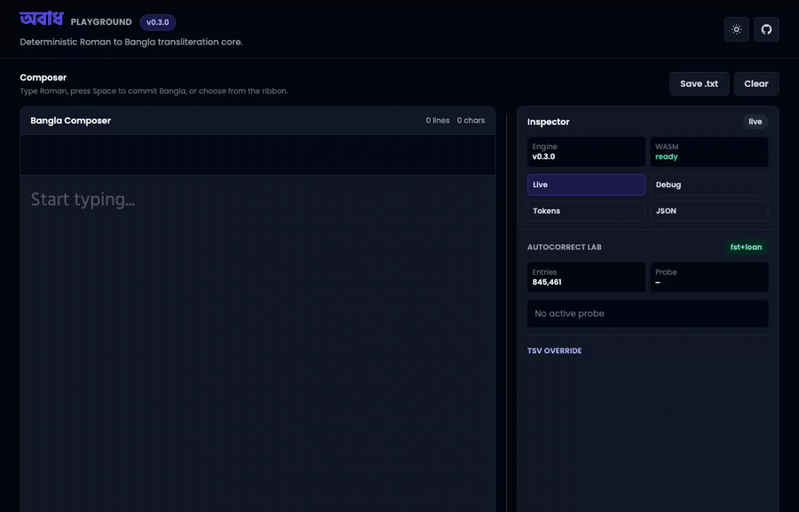
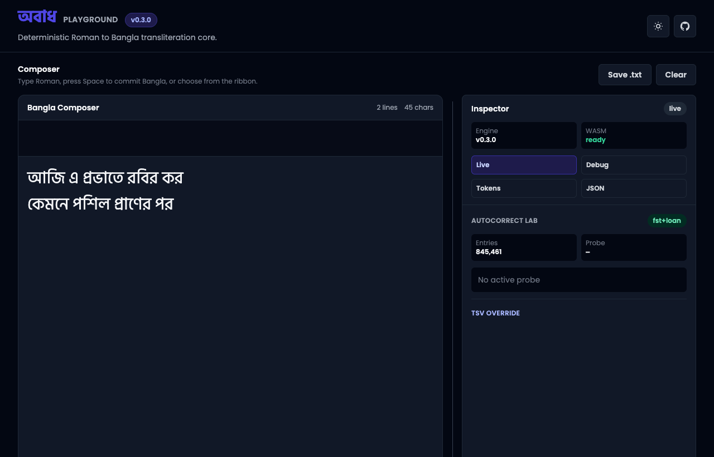
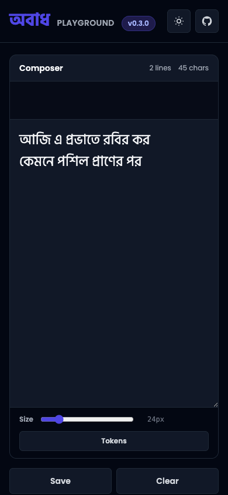

# Obadh Engine

Obadh is a deterministic Roman to Bangla transliteration engine for a larger Bangla typing system. The core crate is deliberately rule-based, fast, and predictable: a Roman input sequence maps to a Bengali output because a documented rule says so, not because a dictionary guessed the word.

This project is an Avro successor in ambition, but the base layer is not an Avro clone and not a word-by-word compatibility table. Users should type deliberately according to Obadh's own Roman rule contract. Correction, suggestion, ranking, personalization, and future neural context models live above the deterministic core.

Live playground: [https://sayom.me/obadh_engine/](https://sayom.me/obadh_engine/)



## v0.3.0 Snapshot

- Deterministic core version: `0.3.0`
- Playground version: `0.3.0`
- Runtime Bangla autocorrect artifact: FST, `845,461` entries, `8,847,897` bytes
- Runtime English-loanword artifact: FST, `1,776` English keys, `1,815` entries, `89,427` bytes
- Optimized WASM payload: about `280 KB`
- Release CLI transliteration sample: `100,000` iterations averaged `0.002815 ms` per run locally

Metrics above were measured from the checked-in v0.3.0 artifacts on June 21, 2026. They are engineering sanity checks, not a production SLA.

## Demo

The current playground uses one composer surface. Space commits the deterministic Obadh draft; autocorrect suggestions are shown in the ribbon and must be selected deliberately.

Demo Roman input:

```text
aji e probhate robir kor
kemone poshil praNer por
```

Committed output:

```text
আজি এ প্রভাতে রবির কর
কেমনে পশিল প্রাণের পর
```

Desktop:



Mobile:



## Core Contract

Obadh's deterministic transliterator must remain dictionary-free.

- No whole-word correction table in the core.
- No hidden compatibility aliases just because another keyboard accepted them.
- No ML or corpus dependency on the transliteration hot path.
- Rule aliases must have an Obadh-specific phonetic, orthographic, or ergonomic reason.
- If a spelling needs correction or ranking, that belongs in the autocorrect layer above the core.

The rule tables are documented and tested from source files under `data/rules/`. Representative deliberate signals:

| Roman Signal | Bengali Rule Intent |
| --- | --- |
| `o` | inherent অ / lowercase cluster separator |
| `a` / `A` | visible আ / া, including before clusters |
| `I`, `U`, `O` | long ঈ / ঊ and ও |
| `aY` / `AY` | অ্যা / ্যা, e.g. `aYp` -> `অ্যাপ` |
| `ng`, `M`, `Ng` | anusvara / explicit anusvara escape / velar nasal |
| `ngg`, `nggh` | ঙ্গ / ঙ্ঘ shorthand |
| `jNG`, `jn`, `gg` | জ্ঞ paths |
| `NGj`, `nj`, `nJ` | ঞ্জ paths |
| `rr` + cluster | reph over a valid cluster |
| `rZy` / `rZY` | non-conjunct ZWNJ-separated র‌্য form |
| `y`, `w` | য-ফলা / ব-ফলা markers in declared clusters |
| `,,` | explicit hasant / conjunct boundary command |
| <code>t``</code> / <code>T``</code> | খণ্ড ত / ৎ |
| `^`, `:`, `.`, `$` | chandrabindu, visarga, danda, taka sign |

Full rule sources:

- `data/rules/consonants.md`
- `data/rules/vowels.md`
- `data/rules/simplified_rules.md`
- `data/rules/deliberate_input_corpus.md`
- `data/conjuncts.csv`

## Autocorrect Layer

The autocorrect workbench is separate from the deterministic core. Obadh first produces a Bengali baseline. The autocorrect layer then retrieves valid lexicon candidates from compact FST artifacts and ranks them using bounded, explainable channels.

Current runtime channels:

- exact Obadh baseline lookup
- bounded Obadh-aware Roman repair, such as missing lowercase `o` separators
- Bangla weighted edit lookup over the FST
- narrow vowel-length and nasal-mark rescue channels
- exact-stem suffix completion
- curated English-loanword exact and bounded fuzzy lookup
- bounded prefix completion

The runtime does not parse CSV/TSV files, EPUBs, JSON corpora, or large heap-resident trie structures. Native tools can memory-map the FST. WASM loads the same compact artifact bytes.

Data policy and rebuild commands live in [data/autocorrect/README.md](data/autocorrect/README.md).

## Quick Start

Install the pinned Rust toolchain and web build tools:

```bash
rustup toolchain install 1.89.0
brew install wasm-pack binaryen
cd www && npm install && cd ..
```

Run the CLI:

```bash
cargo run --bin obadh -- 'kA khA gA t`` 12.34'
# কা খা গা ৎ ১২.৩৪
```

Run with debug JSON:

```bash
cargo run --bin obadh -- --debug --pretty 'aji e probhate robir kor'
```

Run the playground locally:

```bash
./build.sh dev
```

Build GitHub Pages distribution:

```bash
./build.sh dist
```

Run tests:

```bash
cargo test
```

Run hot-path benchmarks:

```bash
cargo bench --bench hot_path
```

## Web / WASM Usage

```javascript
import init, { ObadhaWasm } from './js/obadh_engine.js';

await init();
const engine = new ObadhaWasm();

console.log(engine.transliterate('aji e probhate robir kor'));
// আজি এ প্রভাতে রবির কর
```

Strict transliteration returns the original text unchanged when unsupported characters are present. Use `transliterate_lenient` only when the caller deliberately wants unsupported characters removed before transliteration.

## Rust Library Usage

```rust
use obadh_engine::ObadhEngine;

let engine = ObadhEngine::new();
let bangla = engine.transliterate("aji e probhate robir kor");

assert_eq!(bangla, "আজি এ প্রভাতে রবির কর");
```

For editor integrations, reuse buffers where possible:

```rust
use obadh_engine::{ObadhEngine, PhoneticUnit};

let engine = ObadhEngine::new();
let mut units: Vec<PhoneticUnit> = Vec::new();

engine.tokenize_phonetic_into("rrkSh", &mut units);
engine.tokenize_phonetic_into("praNer", &mut units);
```

## Autocorrect CLI

Inspect shipped artifacts:

```bash
cargo run --release --bin obadh-autocorrect -- inspect-fst-lexicon \
  --input data/autocorrect/models/bn.fst --pretty

cargo run --release --bin obadh-autocorrect -- inspect-loanword-lexicon \
  --input data/autocorrect/models/en_bn_loanwords.fst --pretty
```

Probe the production FST path:

```bash
cargo run --release --bin obadh-autocorrect -- suggest-fst \
  --lexicon data/autocorrect/models/bn.fst \
  --loanwords data/autocorrect/models/en_bn_loanwords.fst \
  --input sushil \
  --max-distance 2 \
  --max-candidates 512 \
  --max-prefix-candidates 24 \
  --response-candidates 8 \
  --pretty
```

Example behavior:

- `sushil` keeps deterministic `সুশিল` visible and ranks corpus-supported `সুশীল`.
- `University` resolves through the case-normalized English-loanword FST to `ইউনিভার্সিটি`.
- `okalpokk` can surface `অকালপক্ক` through a bounded Roman separator repair.

## Performance Checks

Commands used for the current snapshot:

```bash
cargo run --release --bin obadh -- \
  --benchmark 100000 --debug --pretty \
  'ami sushil likhchi. cad dariye university 123.45 ...'

cargo run --release --bin obadh-autocorrect -- inspect-fst-lexicon \
  --input data/autocorrect/models/bn.fst --pretty

cargo run --release --bin obadh-autocorrect -- inspect-loanword-lexicon \
  --input data/autocorrect/models/en_bn_loanwords.fst --pretty
```

Measured output from this release pass:

| Check | Result |
| --- | --- |
| transliteration sample average | `0.002815 ms` |
| sample iterations | `100,000` |
| Bangla FST entries | `845,461` |
| Bangla FST bytes | `8,847,897` |
| English loanword keys | `1,776` |
| English loanword FST bytes | `89,427` |
| optimized WASM | about `280 KB` |

Autocorrect CLI process timings are not reported as keyboard latency because process startup dominates those measurements. Keyboard-time performance should be measured inside the loaded runtime.

## Project Layout

```text
src/engine/                 deterministic tokenizer/transliterator
src/definitions/            compiled rule tables
src/autocorrect/            FST candidate generation and ranking primitives
src/wasm/                   WebAssembly bindings
src/bin/                    CLI binaries
data/rules/                 documented deterministic rule sources
data/autocorrect/           auditable lexicon TSVs and FST artifacts
tools/autocorrect/          corpus and loanword data utilities
www/                        playground source
docs/                       generated GitHub Pages distribution
tests/                      regression suite
benches/                    Criterion hot-path benchmarks
```

`docs/` is generated by `./build.sh dist`. Do not edit generated CSS, WASM, or copied distribution files directly.

## Release Checklist

```bash
cargo test
cargo bench --bench hot_path --no-run
./build.sh dist
git status --short
```

For a tagged release, bump the Cargo/npm versions together, rebuild `docs/`, commit source plus generated artifacts, push, then tag the exact commit.
