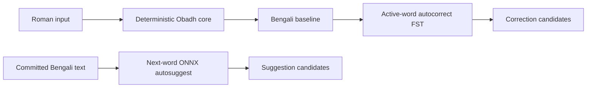

# Obadh Engine

Obadh is a deterministic Roman-to-Bangla transliteration engine for a larger
Bangla typing system. The base layer is deliberately rule-based: a Roman input
sequence maps to Bengali because a documented rule says so, not because a
dictionary guessed the word.

This project is an Avro successor in ambition, but the deterministic core is
not an Avro clone and not a word-by-word compatibility table. Users type
deliberately according to Obadh's own Roman rule contract. Correction,
suggestion, ranking, personalization, and neural context models live above that
core.

Live playground: [https://sayom.me/obadh_engine/](https://sayom.me/obadh_engine/)

## Quick Start

```bash
git clone https://github.com/nsssayom/obadh_engine.git
cd obadh_engine
./init.sh
```

`init.sh` initializes the direct data submodules, resolves Git LFS objects, and
installs web dependencies:

| Path | Data repo |
| --- | --- |
| `data/autocorrect` | [`nsssayom/obadh_autocorrect_dataset`](https://github.com/nsssayom/obadh_autocorrect_dataset) |
| `data/autosuggest` | [`nsssayom/obadh_autosuggest_dataset`](https://github.com/nsssayom/obadh_autosuggest_dataset) |

Native prerequisites that are not installed by `init.sh`:

```bash
rustup toolchain install 1.89.0
brew install wasm-pack binaryen
```

Common commands:

```bash
cargo run --bin obadh -- 'aji e probhate robir kor'
./build.sh dev
./build.sh dist
cargo test
cargo bench --bench hot_path
```

## Runtime Shape



## Core Contract

The deterministic transliterator must remain dictionary-free.

- No whole-word correction table in the core.
- No hidden compatibility aliases just because another keyboard accepted them.
- No ML or corpus dependency on the transliteration hot path.
- Rule aliases need an Obadh-specific phonetic, orthographic, or ergonomic reason.
- Spelling correction and ranking belong in layers above the core.

Representative deliberate signals:

| Roman Signal | Bengali Rule Intent |
| --- | --- |
| `o` | inherent অ / lowercase cluster separator |
| `a` / `A` | visible আ / া, including before clusters |
| `I`, `U`, `O` | long ঈ / ঊ and ও |
| `aY` / `AY` | অ্যা / ্যা, e.g. `aYp` -> `অ্যাপ` |
| `ng`, `M`, `Ng` | anusvara / explicit anusvara escape / velar nasal |
| `ngg`, `nggh` | ঙ্গ / ঙ্ঘ shorthand |
| `jNG`, `jn`, `gg` | জ্ঞ paths |
| `NGj`, `nj`, `nJ` | ঞ্জ paths |
| `rr` + cluster | reph over a valid cluster |
| `rZy` / `rZY` | non-conjunct ZWNJ-separated র‌্য form |
| `y`, `w` | য-ফলা / ব-ফলা markers in declared clusters |
| `,,` | explicit hasant / conjunct boundary command |
| <code>t``</code> / <code>T``</code> | খণ্ড ত / ৎ |
| `^`, `:`, `.`, `$` | chandrabindu, visarga, danda, taka sign |

Rule sources live under `data/rules/` and are checked by tests.

## Autocorrect

Autocorrect is an active-word layer above the deterministic core. Obadh first
produces a Bengali baseline. The autocorrect layer then retrieves valid lexicon
candidates from compact FST artifacts and ranks them through bounded,
explainable channels.

Current runtime channels:

- exact Obadh baseline lookup
- bounded Obadh-aware Roman repair, such as missing lowercase `o` separators
- Bangla weighted edit lookup over the FST
- narrow vowel-length and nasal-mark rescue channels
- exact-stem suffix completion
- curated English-loanword exact and bounded fuzzy lookup
- bounded prefix completion

Runtime code does not parse CSV, TSV, EPUB, JSON, or large heap-resident trie
structures. Native tools can memory-map the FST; WASM loads the same compact
artifact bytes.

Inspect shipped artifacts:

```bash
cargo run --release --bin obadh-autocorrect -- inspect-fst-lexicon \
  --input data/autocorrect/models/bn.fst --pretty

cargo run --release --bin obadh-autocorrect -- inspect-loanword-lexicon \
  --input data/autocorrect/models/en_bn_loanwords.fst --pretty
```

Probe the production FST path:

```bash
cargo run --release --bin obadh-autocorrect -- suggest-fst \
  --lexicon data/autocorrect/models/bn.fst \
  --loanwords data/autocorrect/models/en_bn_loanwords.fst \
  --input sushil \
  --max-distance 2 \
  --max-candidates 512 \
  --max-prefix-candidates 24 \
  --response-candidates 8 \
  --pretty
```

The autocorrect dataset repo contains the auditable lexicon TSVs and runtime
FSTs. Build commands and corpus policy are documented in
`data/autocorrect/README.md` after `./init.sh`.

## Next-Word Autosuggest

Autosuggest is the next-word layer above committed Bengali text. It does not
run while a Roman token is active, does not transliterate Roman input, and does
not replace active-word autocorrect.

The playground loads `obadh-autosuggest-next-word` v1:

| Item | Value |
| --- | --- |
| model family | compact fixed-context Transformer |
| task | next Bengali word prediction |
| context | newest `16` committed Bengali tokens |
| short context behavior | left-pad with `<pad>` and include `<bos>` |
| vocabulary | `32,768` tokens |
| embedding dim | `192` |
| layers / heads | `2` / `4` |
| FFN dim | `512` |
| export | ONNX opset `17` |
| playground runtime | ONNX Runtime Web WASM |

If the user has typed fewer than 16 committed words, missing slots are padded.
If the user has typed more, only the newest 16 tokens are used.

Corpus snapshot:

| Source | Documents | Sentences | Tokens |
| --- | ---: | ---: | ---: |
| curated EPUB | `13` | `159,068` | `1,472,288` |
| Bangla Wikipedia | `169,736` | `4,297,804` | `54,560,642` |
| Bangla newspaper | `408,471` | `8,887,488` | `105,605,338` |
| total | `578,220` | `13,344,360` | `161,638,268` |

The vocabulary is built with `min_frequency = 3`, covers `148,611,832` corpus
tokens, and reaches `91.94%` token coverage.

Baseline evaluation snapshot:

| Metric | Value |
| --- | ---: |
| loss | `6.1471` |
| perplexity | `467.38` |
| top-1 | `15.39%` |
| top-3 | `24.79%` |
| top-5 | `29.68%` |

These numbers are for reproducibility and regression checks only. The current
ONNX artifact validates the integration path, not product-quality autosuggest
accuracy.

Run a local ONNX sanity check:

```bash
python3 -m pip install -r tools/autosuggest/requirements.txt

python3 -m tools.autosuggest.neural.predict \
  --onnx data/autosuggest/models/neural/autosuggest.onnx \
  --vocab data/autosuggest/models/neural/vocab.tsv \
  --context 'আমি আজ' \
  --top-k 5
```

Expected candidates currently include `সকালে`, `বৃহস্পতিবার`, `মঙ্গলবার`,
`সোমবার`, and `শনিবার`.

## Data Policy

The main repo owns source code, docs, tests, the playground, and generated
GitHub Pages assets. Heavy data lives in data-only submodules mounted at the
same paths used by the tools:

```text
data/autocorrect   -> obadh_autocorrect_dataset
data/autosuggest   -> obadh_autosuggest_dataset
```

Those dataset repos may use Git LFS for corpora, TSVs, FSTs, and ONNX model
artifacts. They must not contain training/runtime code. GitHub Pages runtime
files under `docs/` are real bytes, not LFS pointers, because Pages branch
deploys do not serve LFS objects as ordinary static assets.

Manual submodule recovery:

```bash
git submodule update --init --recursive -- data/autocorrect data/autosuggest
git -C data/autocorrect lfs pull
git -C data/autosuggest lfs pull
```

## Web / WASM Usage

```javascript
import init, { ObadhaWasm } from './js/obadh_engine.js';

await init();
const engine = new ObadhaWasm();

console.log(engine.transliterate('aji e probhate robir kor'));
// আজি এ প্রভাতে রবির কর
```

Strict transliteration returns the original text unchanged when unsupported
characters are present. Use `transliterate_lenient` only when the caller
deliberately wants unsupported characters removed before transliteration.

## Rust Library Usage

```rust
use obadh_engine::ObadhEngine;

let engine = ObadhEngine::new();
let bangla = engine.transliterate("aji e probhate robir kor");

assert_eq!(bangla, "আজি এ প্রভাতে রবির কর");
```

For editor integrations, reuse buffers where possible:

```rust
use obadh_engine::{ObadhEngine, PhoneticUnit};

let engine = ObadhEngine::new();
let mut units: Vec<PhoneticUnit> = Vec::new();

engine.tokenize_phonetic_into("rrkSh", &mut units);
engine.tokenize_phonetic_into("praNer", &mut units);
```

## Current Metrics

| Check | Result |
| --- | --- |
| transliteration sample average | `0.002815 ms` |
| sample iterations | `100,000` |
| Bangla FST entries | `845,461` |
| Bangla FST bytes | `8,847,897` |
| English loanword keys | `1,776` |
| English loanword FST bytes | `89,427` |
| optimized WASM | about `280 KB` |
| autosuggest ONNX | `28,148,266` bytes |
| autosuggest vocab | `1,058,854` bytes |
| autosuggest browser latency sample | about `1.8-3.3 ms` |

Autocorrect CLI process timings are not reported as keyboard latency because
process startup dominates those measurements. Keyboard-time performance should
be measured inside loaded runtimes.

## Project Layout

```text
src/engine/                 deterministic tokenizer/transliterator
src/definitions/            compiled rule tables
src/autocorrect/            FST candidate generation and ranking primitives
src/wasm/                   WebAssembly bindings
src/bin/                    CLI binaries
data/rules/                 documented deterministic rule sources
data/autocorrect/           direct data submodule: lexicon TSVs and FSTs
data/autosuggest/           direct data submodule: corpus, vocab, ONNX model
tools/autocorrect/          corpus and loanword data utilities
tools/autosuggest/          sentence corpus and neural model utilities
www/                        playground source
docs/                       generated GitHub Pages distribution
tests/                      regression suite
benches/                    Criterion hot-path benchmarks
```

`docs/` is generated by `./build.sh dist`. Do not edit generated CSS, WASM, or
copied distribution files directly.

## Release Checklist

```bash
cargo test
cargo bench --bench hot_path --no-run
./build.sh dist
git status --short
```

For a tagged release, bump the Cargo/npm versions together, rebuild `docs/`,
commit source plus generated artifacts, push, then tag the exact commit.
