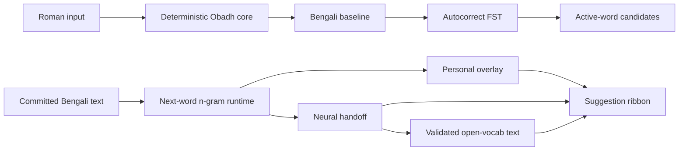

# Obadh Engine

Obadh is a deterministic Roman-to-Bangla transliteration engine and runtime SDK
for Bangla typing systems. The core transliterator is deliberately rule-based:
Roman input becomes Bengali because an Obadh rule says so, not because a
dictionary or model guessed a word.

Obadh is an Avro successor in ambition, but not an Avro clone. The deterministic
layer has its own deliberate Roman contract. Autocorrection, next-word
autosuggestion, personalization, and neural context models live above that core
as separate runtime layers.

Live playground: [https://sayom.me/obadh_engine/](https://sayom.me/obadh_engine/)

## Index

- [Install](#install)
- [SDK Shape](#sdk-shape)
- [Architecture](#architecture)
- [Deterministic Core](#deterministic-core)
- [Autocorrect](#autocorrect)
- [Autosuggest](#autosuggest)
- [C ABI](#c-abi)
- [Runtime Data](#runtime-data)
- [WASM Playground](#wasm-playground)
- [Rust Usage](#rust-usage)
- [Performance Snapshot](#performance-snapshot)
- [Project Layout](#project-layout)
- [Release Checklist](#release-checklist)

## Install

Use the Rust library crate for native integrations:

```toml
obadh_engine = "0.9.0"
```

The default feature set is empty. Native downstreams, including iOS wrappers,
do not pay for CLI tooling or browser/WASM dependencies.

Optional features:

```toml
# CLI tools and artifact builders.
obadh_engine = { version = "0.9.0", features = ["cli"] }

# Browser/WASM bindings for the playground.
obadh_engine = { version = "0.9.0", features = ["wasm"] }
```

Repository setup for development:

```bash
git clone https://github.com/nsssayom/obadh_engine.git
cd obadh_engine
./init.sh
```

`init.sh` initializes the data submodules, resolves Git LFS objects, verifies
required runtime artifacts, and installs playground dependencies.

Native prerequisites not installed by `init.sh`:

```bash
rustup toolchain install 1.89.0
brew install wasm-pack binaryen
```

Common developer commands:

```bash
cargo run --features cli --bin obadh -- 'aji e probhate robir kor'
cargo test
cargo test --features cli
./build.sh dev
./build.sh dist
```

## SDK Shape

`obadh_engine` is a Rust library crate. Its default public API is the native SDK
surface:

- deterministic transliteration and tokenization
- active-word autocorrect primitives
- next-word autosuggest runtime
- bounded personal autosuggest snapshots
- native scorer/generator handoff helpers for Core ML/ONNX next-word models
- validated open-vocabulary generated-word candidates for native generators
- a stable C ABI for native integrators, behind the `cabi` feature ([C ABI](#c-abi))

The crate ships source code, tests, and small deterministic rule fixtures. It
does not bundle large runtime model artifacts. Those artifacts are versioned in
data-only repositories and pinned by this repo as submodules.

Feature policy:

| Feature | Purpose | Pulls in |
| --- | --- | --- |
| default | native SDK surface | no CLI or browser dependencies |
| `cli` | command-line tools and corpus/artifact builders | `clap`, ZIP/EPUB helpers |
| `wasm` | browser playground bindings | `wasm-bindgen`, `web-sys` |
| `cabi` | stable C ABI for native integrators | no extra dependencies |

## Architecture



The typing path is split intentionally:

1. The deterministic core converts the active Roman token to a Bengali baseline.
2. Autocorrect searches compact Bengali/loanword FST artifacts for active-word
   alternatives.
3. Once a Bengali word is committed, autosuggest uses committed Bengali context
   to produce next-word candidates.
4. The personal overlay adjusts next-word suggestions locally without mutating
   global model artifacts.
5. Native platforms can pass fixed buffers to Core ML/ONNX and return model
   scores, token IDs, or generated Bengali word candidates to Rust.
6. Rust validates, deduplicates, scores, and merges all suggestion channels.

## Deterministic Core

The core is dictionary-free and must stay that way.

- No whole-word compatibility table in transliteration.
- No hidden aliases just because another keyboard accepts them.
- No ML or corpus dependency on the Roman-to-Bangla hot path.
- Rule aliases need an Obadh-specific phonetic, orthographic, or ergonomic
  reason.
- Spelling correction and ranking belong above the deterministic layer.

Representative deliberate signals:

| Roman Signal | Bengali Rule Intent |
| --- | --- |
| `o` | inherent অ / lowercase cluster separator |
| `a` / `A` | visible আ / া, including before clusters |
| `I`, `U`, `O` | long ঈ / ঊ and ও |
| `aY` / `AY` | অ্যা / ্যা, e.g. `aYp` -> `অ্যাপ` |
| `ng`, `M`, `Ng` | anusvar / explicit anusvar escape / velar nasal |
| `ngg`, `nggh` | ঙ্গ / ঙ্ঘ shorthand |
| `jNG`, `jn`, `gg` | জ্ঞ paths |
| `NGj`, `nj`, `nJ` | ঞ্জ paths |
| `rr` + cluster | reph over a valid cluster |
| `rZy` / `rZY` | non-conjunct ZWNJ-separated র‌্য form |
| `y` / `Y` | য-ফলা after a consonant base (productive): `ply` -> `প্ল্য`, `plYan` -> `প্ল্যান`; standalone য় |
| `w` | ব-ফলা after a consonant (`kw` -> `ক্ব`); standalone ওয় glide (`waTar` -> `ওয়াটার`) |
| `q`, `qq` | ক (qaf): `iraq` -> `ইরাক`; `qq` -> চন্দ্রবিন্দু ঁ, resolved ahead of `q` by longest match (`baqq` -> `বাঁ`) |
| `x` | ক্স: `box` -> `বক্স`, `fix` -> `ফিক্স` |
| `,,` | explicit hasant / conjunct boundary command |
| <code>t``</code> | খণ্ড ত / ৎ |
| <code>T``</code> | খণ্ড ত / ৎ |
| `^` | chandrabindu |
| `:` | bisarga |
| `.` | danda, while decimal periods stay ASCII periods |
| `$` | taka sign |

Rule sources live under `data/rules/` and are checked by tests.

## Autocorrect

Autocorrect is an active-word layer above the deterministic core. Obadh first
produces a Bengali baseline. The autocorrect runtime then retrieves valid
lexicon candidates from compact FST artifacts and ranks them through bounded,
explainable channels.

Runtime channels:

- exact deterministic baseline lookup
- Obadh-aware Roman repair, such as missing lowercase `o` separators
- weighted Bengali edit lookup over the FST
- narrow vowel-length and nasal-mark rescue paths
- exact-stem suffix completion
- curated English-loanword exact and bounded fuzzy lookup
- bounded prefix completion

Runtime code does not parse CSV, TSV, EPUB, JSON, or heap-resident tries.
Native tools can memory-map the FST; WASM loads the same compact bytes.

### Candidates and provenance

The runtime returns ranked candidates for the active word. Each candidate
carries the provenance a caller needs to rank, filter, or gate it:

- `source` — the channel that produced it (exact, weighted edit, diacritic or
  vowel-length rescue, roman repair, exact/fuzzy loanword, prefix or stem
  completion, phonetic skeleton, consonant confusion);
- `edit_cost` — Bangla-side edit distance from the baseline;
- `roman_repair_cost` — roman-side cost when the candidate came from a roman
  repair; a one-key roman slip can be a large Bangla-side change but a small
  roman one;
- `frequency` — the candidate word's lexicon frequency.

The Rust API exposes these on `FstCandidate` (`FstLexicon::suggest`); the C ABI
exposes them through `obadh_autocorrect_suggest_detailed`.

### Auto-insert policy

Whether to *silently apply* a correction is a client decision: it depends on the
lexicon's frequency data and on product choices — protected words, tap-to-keep,
how aggressive to be. The runtime supplies the signals; the client owns the
policy. A sound reference policy applies the top correction over a non-word
baseline (`obadh_autocorrect_is_lexicon_word` returns 0) when:

- `source` is a confident channel — weighted edit, diacritic, vowel-length,
  exact roman repair, exact loanword, or a single consonant confusion; an
  unrecognized `source` code is treated as not eligible;
- the effective cost — `roman_repair_cost` if present, else `edit_cost` — is
  within tolerance;
- `frequency` clears a floor, and optionally exceeds the baseline word's
  frequency by a ratio, so a much-more-common correction can override a rare
  real-word baseline;
- the word is not user-protected.

Each clause maps to one exposed field.

Inspect artifacts:

```bash
cargo run --release --features cli --bin obadh-autocorrect -- inspect-fst-lexicon \
  --input data/autocorrect/models/bn.fst --pretty

cargo run --release --features cli --bin obadh-autocorrect -- inspect-loanword-lexicon \
  --input data/autocorrect/models/en_bn_loanwords.fst --pretty
```

Probe the production FST path:

```bash
cargo run --release --features cli --bin obadh-autocorrect -- suggest-fst \
  --lexicon data/autocorrect/models/bn.fst \
  --loanwords data/autocorrect/models/en_bn_loanwords.fst \
  --input sushil \
  --max-distance 2 \
  --max-candidates 512 \
  --max-prefix-candidates 24 \
  --response-candidates 8 \
  --pretty
```

## Autosuggest

Autosuggest is the next-word layer above committed Bengali text. It does not run
while a Roman token is active and does not replace active-word autocorrect.

The static runtime is a compact n-gram candidate generator with suffix backoff.
The browser playground uses the compact c16 artifact. Native integrations can
use the c64 candidate artifact plus an optional scorer or generator model.

The neural path is intentionally bounded and platform-runtime agnostic. A scorer
model ranks a static candidate pool. A generator model can return known-vocab
token IDs and, in the native SDK, open-vocabulary Bengali word candidates. Rust
performs validation, deduplication, weighting, and final merge. The model does
not replace lexicon retrieval and does not run on every Roman keystroke.

Open-vocabulary candidates are not dictionary-bound, but they are not unchecked
free-form text either. The SDK accepts generated Bengali words only after a
cheap validator confirms script, word shape, length, mark order, repetition, and
confidence policy. Accepted generated text can be committed immediately and
later learned by the personal overlay as local OOV text.

Personal autosuggest has two lifetimes:

- Session context: recent committed words in the current editor flow; clear at
  editor/session boundaries.
- Personal dictionary: a bounded local overlay; persists only if the host
  exports and stores the compact snapshot.

Obadh owns the snapshot format, vocabulary-fingerprint validation, bounded
learning rules, and merge behavior. Downstream keyboards own storage policy,
privacy controls, and lifecycle timing. A missing or fingerprint-mismatched
snapshot must be treated as an empty personal dictionary.

For keyboard integrations:

- keep an `AutosuggestContext` as words are committed
- resolve vocabulary IDs once and prefer token-ID APIs on the hot path
- call `suggest_ids_for_context_into` with reused buffers
- use `AutosuggestSession` when personal overlay behavior is needed
- use `AutosuggestScorerSession` for a cheaper candidate-ranking model
- use `AutosuggestGeneratorSession` for known-token or open-vocab generation
- pass generated text through `accept_open_vocab_text_outputs`
- read final native candidates from the unified open-vocab merge path
- persist with `write_personal_snapshot_into`
- restore with `import_personal_snapshot`
- call `push_boundary()` on sentence/editor boundaries

Validate the packaged generator:

```bash
cargo run --release --features cli --bin obadh-autosuggest -- validate-generator \
  --model data/autosuggest/models/ngram/autosuggest-ngram-c64.bin \
  --manifest data/autosuggest/models/neural/autosuggest-generator-gru256-topk128-c64-balanced.manifest.json \
  --pretty
```

Benchmark an n-gram artifact:

```bash
cargo run --release --features cli --bin obadh-autosuggest -- bench \
  --model data/autosuggest/models/ngram/autosuggest-ngram.bin \
  --context 'আমি আজ' \
  --context 'বাংলাদেশের মানুষ' \
  --mode context \
  --iterations 200000 \
  --pretty
```

## C ABI

The `cabi` feature exposes a stable, versioned C ABI for native integrators such
as iOS and Android keyboards. It is off by default; enabling it compiles the
`extern "C"` surface into the crate's `cdylib`/`staticlib`. The header is
[`include/obadh.h`](include/obadh.h).

```toml
obadh_engine = { version = "0.9.0", features = ["cabi"] }
```

Surface, all over opaque handles created by `*_open` / `*_new` and released by
the matching `*_free`:

| Area | Functions |
| --- | --- |
| Deterministic | `obadh_transliterate`, `obadh_transliterate_lenient` |
| Autocorrect | `obadh_autocorrect_open`, `obadh_autocorrect_suggest`, `obadh_autocorrect_suggest_detailed`, `obadh_compose_suggestions`, `obadh_autocorrect_word_alternatives`, `obadh_autocorrect_is_lexicon_word`, `obadh_autocorrect_fingerprint` |
| Autosuggest | `obadh_autosuggest_open`, `obadh_autosuggest_commit`, `obadh_autosuggest_suggest`, `obadh_autosuggest_suggest_for_context`, personal-overlay `clear` / snapshot `export` / `import`, `obadh_autosuggest_fingerprint` |
| Version | `obadh_abi_version`, `obadh_engine_version` |

Conventions:

- **Sizing.** Every writer is snprintf-style: it returns the number of bytes the
  result needs and copies only when the buffer fits. A caller passes a small
  stack scratch and reallocates only on overflow.
- **String lists** are one buffer of `[u32 count]` then `[u32 len][utf8 bytes]`
  records — no in-band delimiter, so any bytes and empty strings round-trip.
- **Detailed candidate records** (`obadh_autocorrect_suggest_detailed`) extend
  each record with `[u8 source][u16 edit_cost][u16 roman_repair_cost][u64 frequency]`.
  `source` is a frozen, append-only code — treat an unrecognized value as not
  auto-replaceable — and `roman_repair_cost` is `0xFFFF` for a native-side edit.
- **UTF-8.** Inputs are `(pointer, length)` byte spans; invalid UTF-8 makes the
  call a no-op. A handle is not shared across threads without external locking.

The ABI version (`obadh_abi_version`, currently `2`) is independent of the
crate's semantic version: additive symbols leave it unchanged, while a removed or
changed symbol bumps it. Load-time artifact checks use the fingerprint accessors
(see [Runtime Data](#runtime-data)).

## Runtime Data

Large runtime data is not published inside the crates.io tarball. The crate
stays small and auditable; data-only repositories carry corpora, TSVs, FSTs,
n-gram artifacts, and neural packages.

| Path | Data repo |
| --- | --- |
| `data/autocorrect` | [`nsssayom/obadh_autocorrect_dataset`](https://github.com/nsssayom/obadh_autocorrect_dataset) |
| `data/autosuggest` | [`nsssayom/obadh_autosuggest_dataset`](https://github.com/nsssayom/obadh_autosuggest_dataset) |

Manual recovery:

```bash
git submodule update --init --recursive -- data/autocorrect data/autosuggest
git -C data/autocorrect lfs pull
git -C data/autosuggest lfs pull
```

Runtime artifact map:

| Runtime | Required artifacts |
| --- | --- |
| deterministic core | none |
| autocorrect | `data/autocorrect/models/bn.fst` |
| autocorrect loanwords | `data/autocorrect/models/en_bn_loanwords.fst` |
| browser autosuggest | `data/autosuggest/models/ngram/autosuggest-ngram.bin` |
| native autosuggest | `data/autosuggest/models/ngram/autosuggest-ngram-c64.bin` |
| neural next-word package | generator manifest plus Core ML or ONNX model |

Fresh source checkouts should use `./init.sh`. Runtime applications should pin
an engine crate version and a compatible data commit/tag, then bundle only the
artifacts needed by that target.

For iOS, the downstream `obadh-ios` package should bundle autocorrect FSTs, the
c64 n-gram, the generator manifest, and a compiled Core ML model. Corpora, raw
TSVs, training checkpoints, and builder outputs should not ship inside the
keyboard extension.

Corpus snapshot used by the current autosuggest package:

| Source | Documents | Sentences | Tokens |
| --- | ---: | ---: | ---: |
| curated EPUB | `13` | `159,068` | `1,472,288` |
| Bangla Wikipedia | `169,736` | `4,297,804` | `54,560,642` |
| Bangla newspaper | `408,471` | `8,887,488` | `105,605,338` |
| total | `578,220` | `13,344,360` | `161,638,268` |

The autosuggest vocabulary uses `32,768` tokens, covers `148,611,832` corpus
tokens, and reaches `91.94%` token coverage.

## WASM Playground

The playground is a browser testing surface for the same core runtime. Build it
with the explicit `wasm` feature:

```bash
./build.sh wasm
npm --prefix www run serve
```

`./build.sh dev` runs the Tailwind watcher plus the lightweight `www/` server.
The dev server is an npm-only playground tool and is outside the Rust crate
dependency graph.

WASM usage:

```javascript
import init, { ObadhaWasm } from './js/obadh_engine.js';

await init();
const engine = new ObadhaWasm();

console.log(engine.transliterate('aji e probhate robir kor'));
// আজি এ প্রভাতে রবির কর
```

WASM autosuggest exposes the same session/personal concepts through
`commitTokenId`, `commitToken`, `commitUnknown`, `suggestSession`,
`suggestSessionCandidates`, `exportPersonalSnapshot`, and
`importPersonalSnapshot`.

## Rust Usage

Basic transliteration:

```rust
use obadh_engine::ObadhEngine;

let engine = ObadhEngine::new();
let bangla = engine.transliterate("aji e probhate robir kor");

assert_eq!(bangla, "আজি এ প্রভাতে রবির কর");
```

Reusable editor buffers:

```rust
use obadh_engine::{ObadhEngine, PhoneticUnit};

let engine = ObadhEngine::new();
let mut units: Vec<PhoneticUnit> = Vec::new();

engine.tokenize_phonetic_into("rrkSh", &mut units);
engine.tokenize_phonetic_into("praNer", &mut units);
```

Strict transliteration returns the original text unchanged when unsupported
characters are present. Use `transliterate_lenient` only when the caller
deliberately wants unsupported characters removed before transliteration.

## Performance Snapshot

| Check | Result |
| --- | --- |
| transliteration sample average | `0.002815 ms` |
| Bangla FST entries | `845,461` |
| Bangla FST bytes | `8,847,897` |
| English loanword keys | `1,776` |
| English loanword FST bytes | `89,427` |
| optimized WASM | about `280 KB` |
| autosuggest n-gram artifact | `25,195,978` bytes |
| autosuggest c64 candidate artifact | `29,486,274` bytes |
| autosuggest INT8 generator | `18,492,708` bytes |
| autosuggest Core ML generator package | `17,668,804` bytes |
| autosuggest native context lookup sample | `~0.185 us` |
| autosuggest c64 candidate-input sample | `~0.83 us` |
| autosuggest generator scored-union handoff | `~14.38 us` release, personal-aware |
| autosuggest Core ML generator sample | `~459 us` |

Autosuggest package quality snapshot:

| Path | top-1 all | top-5 all | top-10 all |
| --- | ---: | ---: | ---: |
| static c64 pool | `16.84%` | `31.34%` | `37.99%` |
| scored-union GRU256 | `16.84%` | `32.89%` | `39.42%` |

Replay and held-out metrics are regression signals for runtime packaging, not
claims of final keyboard product accuracy. Keyboard-time performance should be
measured inside loaded platform runtimes, not from CLI process timings.

## Project Layout

```text
src/engine/                 deterministic tokenizer/transliterator
src/definitions/            compiled rule tables
src/autocorrect/            FST candidate generation and ranking primitives
src/autosuggest/            n-gram runtime, personal overlay, neural handoff
src/wasm/                   WebAssembly bindings
src/bin/                    CLI binaries
data/rules/                 documented deterministic rule sources
data/autocorrect/           data submodule: lexicon TSVs and FSTs
data/autosuggest/           data submodule: corpus, vocab, models
tools/autocorrect/          corpus and loanword data utilities
tools/autosuggest/          sentence corpus, vocab, and model utilities
www/                        playground source
docs/                       generated GitHub Pages distribution
tests/                      regression suite
benches/                    Criterion hot-path benchmarks
```

`docs/` is generated by `./build.sh dist`. Do not edit generated CSS, WASM, or
copied distribution files directly.

## Release Checklist

```bash
cargo test
cargo test --features cli
cargo check --target wasm32-unknown-unknown --no-default-features --features wasm --lib
cargo bench --bench hot_path --no-run
cargo publish --dry-run
./build.sh dist
git status --short
```

For a tagged release, bump the Cargo/npm versions together, rebuild `docs/`,
commit source plus generated artifacts, push, publish the crate, then tag the
exact published commit.
